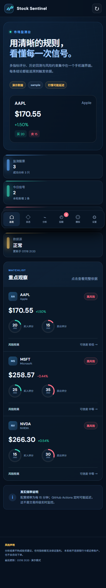
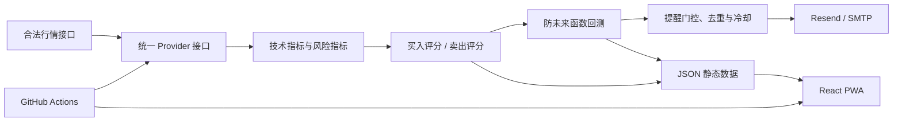

# Stock Sentinel：股票行情监测与买卖提醒系统

Stock Sentinel 是一个面向个人研究的低成本股票监测软件。它用 Python 获取行情、计算技术指标、分别生成 0–100 分的买入与卖出评分、执行无未来函数回测，并把结果发布为适合手机安装的 React + TypeScript PWA。

> **分析结果不构成投资建议，任何指标都无法保证盈利。** 本系统不连接银行卡或证券账户，不保存券商密码，不自动下单。所有评分都是规则驱动的概率分析，必须人工确认。



## 已实现功能

- 可替换数据源：`sample`、`yfinance`、Alpha Vantage、Twelve Data。
- Alpha Vantage 连续请求自动间隔 13 秒；只对临时网络或服务端错误重试两次，额度、代码和参数错误不重试，避免浪费免费调用次数。
- SMA 5/10/20/60、EMA 12/26、MACD、RSI 14、KDJ、布林带、ATR、成交量均线、量比、5/20/60 日涨跌、最大回撤、年化波动、支撑和压力。
- 买入和卖出分别评分，每项依据、得分与未触发原因可查。
- 评分连续两个不同交易日达到阈值后提醒，并支持止盈、止损、异常涨跌、数据源失败和每日总结。
- 同产品同类型提醒默认冷却 24 小时；止损提醒不受普通冷却限制。
- Resend 或 SMTP 授权码邮件；真实密钥只从环境变量读取。
- 回测采用“当天收盘产生信号、下一交易日开盘成交”，计入手续费和滑点。
- 深色响应式 PWA：总览、自选股、详情、提醒历史、模拟交易、设置。
- K 线、成交量、均线、MACD、RSI、布林带、回测资金曲线。
- Service Worker、Web App Manifest、离线缓存和手机主屏安装。
- GitHub Actions：测试、交易日收盘分析、失败通知、GitHub Pages 部署。

## 软件结构



```text
stock-sentinel/
├─ .github/workflows/       自动测试、监测、Pages 部署
├─ config/settings.json     后台监测配置
├─ data/                    生成的分析、提醒与回测数据
├─ frontend/                React + TypeScript PWA
│  ├─ public/data/          Pages 读取的 JSON 镜像
│  └─ src/                  页面、图表、设置与模拟交易
├─ scripts/                 Windows 新手脚本
├─ src/stock_sentinel/      Python 核心程序
│  └─ providers/            可替换行情适配器
├─ tests/                   Python 自动测试
├─ .env.example             环境变量模板（无真实密钥）
└─ 新手操作指南.md           从安装到 GitHub Pages 的逐步说明
```

## 5 分钟运行演示版

环境要求：Python 3.11+、Node.js 20+、PowerShell。

```powershell
cd stock-sentinel
powershell -ExecutionPolicy Bypass -File .\scripts\setup.ps1
powershell -ExecutionPolicy Bypass -File .\scripts\run-demo.ps1
powershell -ExecutionPolicy Bypass -File .\scripts\run-frontend.ps1
```

浏览器打开终端显示的 `http://localhost:5173`。演示模式会生成 AAPL、MSFT、NVDA 的可复现模拟行情，页面会显著显示“演示数据”，不能用于交易。

不使用脚本时，等价命令为：

```powershell
python -m venv .venv
.\.venv\Scripts\python -m pip install -e ".[dev,yfinance]"
.\.venv\Scripts\python -m stock_sentinel demo
cd frontend
npx --yes pnpm@10.15.1 install --frozen-lockfile
npx --yes pnpm@10.15.1 dev
```

## 命令一览

```powershell
# 验证配置
.\.venv\Scripts\python -m stock_sentinel validate

# 强制运行一次监测（本地测试）
.\.venv\Scripts\python -m stock_sentinel monitor --force

# 单独执行历史回测
.\.venv\Scripts\python -m stock_sentinel backtest

# 发送测试邮件；EMAIL_ENABLED=false 时只检查安全关闭状态
.\.venv\Scripts\python -m stock_sentinel test-email

# 自动测试和代码检查
.\.venv\Scripts\python -m pytest
.\.venv\Scripts\python -m ruff check src tests
cd frontend
npx --yes pnpm@10.15.1 test
npx --yes pnpm@10.15.1 build
```

## 配置股票和评分

后台使用 [`config/settings.json`](config/settings.json)。手机设置页也能编辑、导入和导出同结构配置，但 GitHub Pages 是静态网站，浏览器不能直接改仓库；导出后需要用它替换仓库中的 `config/settings.json`。

每只股票支持：代码、名称、市场、持仓成本、数量、目标收益、最大可接受亏损、止盈、止损、邮件开关、买入/卖出提醒和每日总结开关。市场字段支持 `US`、`CN`、`HK`；第一版真实数据重点支持美股，A 股和港股只保留统一接口，能否使用取决于所选服务商和代码格式。

评分默认阈值：

| 类型 | 满分 | 主要条件 |
|---|---:|---|
| 买入评分 | 100 | 均线转强 20、MACD 15、RSI 回升 15、接近支撑 15、量能 10、中期趋势 15、风险允许 10 |
| 卖出评分 | 100 | 均线转弱 15、MACD 15、RSI 回落 10、接近压力 10、止盈 15、止损 20、风险超限 15 |

评分区间仅描述规则强弱，不代表收益承诺：

- 0–29：风险较高；
- 30–44：偏弱，谨慎观察；
- 45–59：中性，继续观察；
- 60–74：偏强，可能存在机会；
- 75–100：强信号，仍需人工确认。

买入与卖出评分是独立结果。若止损、波动或回撤风险优先触发，页面会显示高风险；不会使用“必涨”“稳赚”“最佳买点”“保证收益”等表述。

## 数据源与延迟说明

本项目只调用服务商提供的接口，不抓取明确禁止自动抓取的网站。

| Provider | 是否要 Key | 当前实现 | 页面新鲜度口径 |
|---|---|---|---|
| `sample` | 否 | 固定随机种子的演示 OHLCV | 明确标记非真实行情 |
| `yfinance` | 否 | 日线，适合个人研究 | 保守标记可能延迟、不保证实时 |
| `alpha_vantage` | 是 | `TIME_SERIES_DAILY` | 免费日线按收盘/历史数据标记 |
| `twelve_data` | 是 | `time_series` 日线 | 取决于套餐和市场，保守标记可能延迟 |

数据源调查与选择依据：

- [yfinance 官方仓库](https://github.com/ranaroussi/yfinance) 使用 Apache-2.0 许可，项目明确说明其面向研究/教育且 Yahoo 数据仅限个人使用。本项目只调用其公开 Python API，没有复制来源不明代码。
- [Alpha Vantage 官方文档](https://www.alphavantage.co/documentation/)说明中国沪深市场代码后缀、免费 compact 日线和付费实时权限；[官方支持页](https://www.alphavantage.co/support/)当前说明免费层每天最多 25 次请求，额度可能调整。
- [Twelve Data 官方 API 文档](https://twelvedata.com/docs) 与[定价页](https://twelvedata.com/pricing)说明免费额度、每分钟 credits 和市场覆盖；具体数据权限以用户套餐为准。
- PWA 使用 React、Vite 和浏览器标准 Web App Manifest/Service Worker；参见 [Vite 官方文档](https://vite.dev/guide/static-deploy.html)和 [MDN PWA 文档](https://developer.mozilla.org/docs/Web/Progressive_web_apps)。

服务商的价格、额度、许可和实时权限会变化，请在正式使用前再次阅读官方条款。任何免费接口都不应被描述为交易所级实时行情。

## 邮件通知

复制模板，但不要提交真实 `.env`：

```powershell
Copy-Item .env.example .env
```

推荐 Resend：

```dotenv
EMAIL_ENABLED=true
EMAIL_PROVIDER=resend
EMAIL_TO=your-email@example.com
EMAIL_FROM=Stock Sentinel <alerts@your-verified-domain.com>
RESEND_API_KEY=re_xxx
SITE_URL=https://你的用户名.github.io/stock-sentinel/
```

SMTP 必须使用邮箱授权码，不得使用网页登录密码。日志过滤器会替换已知环境变量中的密钥值；程序也不会打印邮件授权码或 API Key。

默认 `simulation_mode=true`、`live_alerts_enabled=false`。提醒前必须成功回测。即使开启真实数据提醒，也只发邮件，不会连接券商或自动交易。

## 回测口径

- 所有指标只使用当日及此前数据。
- 当日收盘生成信号，在下一交易日开盘价成交。
- 可配置初始资金、手续费、滑点、开始和结束日期。
- 输出总收益、年化收益、最大回撤、胜率、盈亏比、交易次数和买入持有对比。
- 期末未平仓头寸只按最后收盘价估值。

回测没有覆盖税费、停牌、涨跌停、拆股处理差异、极端滑点和全部流动性冲击。历史表现不代表未来。

## GitHub Actions 行为

- `ci.yml`：每次 push/PR 执行 Ruff、Pytest、Vitest 和 PWA 构建。
- `monitor.yml`：工作日 UTC 08:30（北京时间 16:30）调度一次；只在配置真实 Provider 后启用定时任务，并限制在国内市场收盘分析窗口，支持手动强制运行。
- `pages.yml`：构建并部署 `frontend/dist` 到 GitHub Pages。
- 监测工作流使用 `concurrency` 防止重叠，超时 12 分钟；GitHub cron 可能延迟。
- 自动任务会提交 `data/` 和 `frontend/public/data/` 的新 JSON，从而触发 Pages 刷新。

## 数据文件

- `data/dashboard.json`：本轮股票结果和总览。
- `data/alerts.json`：最多 500 条提醒历史。
- `data/backtests.json`：每只股票的回测结果与资金曲线。
- `data/state.json`：提醒确认、去重、数据日期和失败计数状态；由 Actions 提交，但不包含密钥。
- `logs/stock-sentinel.log`：轮转错误日志，已被 `.gitignore` 排除。

## 安全边界

- 不接入银行卡、券商账户或下单权限。
- 不保存证券账户密码，不接受网页邮箱密码。
- `.env`、日志、缓存、虚拟环境和构建依赖均被 `.gitignore` 排除。
- 股票代码、市场、阈值和数值范围在 Python 端校验。
- 免费数据请求带超时、重试、交易时段控制和失败计数。
- GitHub Secrets 只注入 Actions 运行环境，前端构建不会包含它们。

发现安全问题请先停止 Actions、关闭邮件并轮换相关 Key/授权码，不要在公开 Issue 中粘贴密钥。

## 常见问题

**页面显示“演示数据”**：`config/settings.json` 或 `STOCK_DATA_PROVIDER` 仍为 `sample`。正式使用前改为真实 Provider，并确认条款和延迟说明。

**为什么设置页修改后后台没变化**：GitHub Pages 是静态网站。请导出配置，替换仓库里的 `config/settings.json` 并提交。

**为什么 16:30 没有准时运行**：GitHub Actions cron 不是实时调度器，高峰期可能延迟。系统适合收盘后研究，不能用于盘中交易。

**为什么没有邮件**：依次检查 `EMAIL_ENABLED`、服务类型、GitHub Secrets、收件人、发件域名验证和 Actions 日志。先用 `test-email` 验证。

**能否自动买卖**：不能。本项目刻意没有券商接口和交易权限。

完整的新手步骤见 [`新手操作指南.md`](新手操作指南.md)。

## 许可证

本项目代码使用 [MIT License](LICENSE)。行情本身仍受各数据服务商条款约束；本项目许可证不授予第三方行情数据的再分发权。
